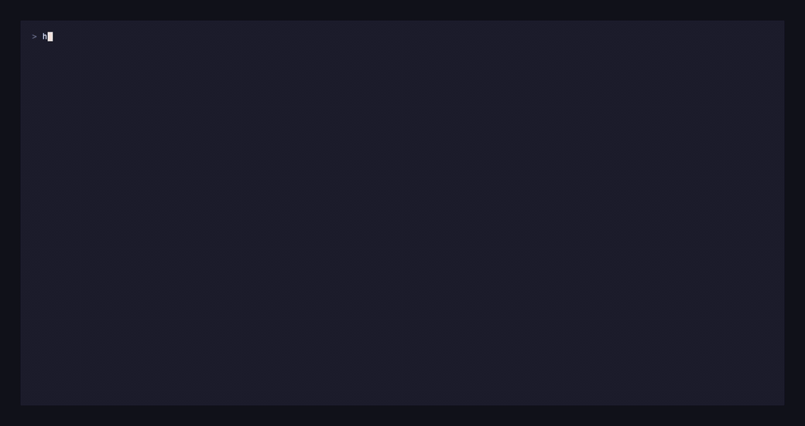
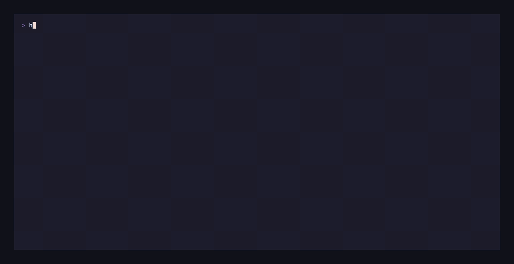

<div align="center">

# Houston

**A terminal workspace for running coding agents and the notes they work from.**

[](https://github.com/Sugar-Coffee/houston-ai/actions/workflows/ci.yml)
[](https://github.com/Sugar-Coffee/houston-ai/releases/latest)
[](LICENSE)
[](https://www.rust-lang.org)
[](#install)

```sh
curl -fsSL https://raw.githubusercontent.com/Sugar-Coffee/houston-ai/main/install.sh | sh
```

<sub>**The repository is private, so that URL does not resolve yet.**
[Build from source](#install) meanwhile. Delete this line when it goes public.</sub>

</div>

<!--
  Recorded with vhs: `brew install vhs && vhs media/sessions.tape`
  Uncomment once media/sessions.gif exists.

<p align="center"></p>
-->

Five views, one keyboard: **Sessions**, **Vault**, **Board**, **Worktrees**,
**Settings**. Runs Claude Code, Codex, Gemini and opencode, or a plain shell.

---

## Sessions

- Several agents at once, each in its own pane, switched with one key
- Status comes from agent **hooks**, not from parsing the screen: working,
  waiting on you, idle, exited
- Sessions survive a restart — names, directories, worktrees, and the
  conversation itself. Claude Code resumes via `--resume`, Codex via its
  rollout files
- A shell comes back in the directory you left it in, not the one it started in
- Select text with the mouse inside a pane — drag, double-click a word,
  triple-click a line, copies on release. Or `c` for a keyboard copy mode
- Full scrollback, keyboard or wheel
- Paste is a single write, so a 200-line paste arrives as one event

## Board

- Kanban of every session: **Needs you** / **Working** / **Shells** / **Finished**
- Driven by hooks, so it does not guess. A shell gets no agent status rather
  than an invented one
- If Houston loses its hooks it says **status frozen** instead of showing a
  value that stopped being true an hour ago

## Worktrees

- Start an agent in an isolated git worktree so several can work on one repo
- Each row says what it is for: **in use**, **uncommitted work**, **idle**, or
  **repository gone**
- `↑ahead ↓behind`, and the diff for each
- `l` lands one: commit, push, open a PR, remove the tree
- `v` reviews the diff without needing a session in it

## Review

- Every session card shows `+142 −31` for what its agent has changed
- `v` opens the full diff in a pane, untracked files included
- Nothing destructive happens without a question naming what would be lost

## Vault

- A folder of plain markdown. No database, no lock-in — open it in Obsidian at
  the same time
- Folder tree: expand, collapse, create, rename, move, delete
- Fuzzy find by name (`/`), full-text search (`f`), `[[wikilinks]]` and backlinks
- `y` copies a note's path, `i` sends `@path` straight into a running agent
- **`c` starts an agent in the vault**, so it arrives already knowing your
  `CLAUDE.md`, skills and rules

## Editor

- Modal, vim-shaped: `i` `a` `o`, `[` `]` between headings, `t` toggles a task
- **Jump mode** — press `f`, every word head gets a tag, type it to go there.
  Tags overlay the text rather than being inserted, so the line does not shift
  under the target you are aiming at
- Soft wrapping that pages and moves in visual rows (91% of a real vault's
  notes have a line over 120 characters)
- Atomic saves and external-modification detection, because Obsidian is
  probably open on the same file
- Undo over rope snapshots, bounded at 1,000 steps

<!--
  `vhs media/editor.tape`

<p align="center"></p>
-->

## Install

```sh
curl -fsSL https://raw.githubusercontent.com/Sugar-Coffee/houston-ai/main/install.sh | sh
```

Detects your platform, downloads the matching build from the latest release,
verifies its checksum, installs to `~/.local/bin`. macOS on Apple silicon or
Intel, Linux on x86-64.

`houston update` installs the latest release over whichever copy you are
running. Houston checks once a day and says so in the tab strip.

> **While the repository is private**, neither of those can reach GitHub —
> `raw.githubusercontent.com` and the release downloads both need
> authentication, so the installer 404s and `houston update` reports no
> releases. Releases are built and published (`v0.0.1` onwards, three targets
> with checksums); they simply are not fetchable anonymously yet. Build from
> source until then:
>
> ```sh
> git clone https://github.com/Sugar-Coffee/houston-ai
> cd houston-ai && cargo build --release
> ./target/release/houston
> ```

<details>
<summary>Other ways</summary>

```sh
# somewhere else
curl -fsSL .../install.sh | HOUSTON_INSTALL_DIR=/usr/local/bin sh

# a specific version
curl -fsSL .../install.sh | HOUSTON_VERSION=v0.0.1 sh

# from source
cargo install --git https://github.com/Sugar-Coffee/houston-ai
```

[Read the script first](install.sh) if you would rather not pipe one into a
shell — it is a hundred lines of POSIX sh, short on purpose.

</details>

## Working with the vault

The vault is a folder of markdown. On first launch Houston makes one at
`~/.houston/vault/` and touches nothing else; point it at an existing Obsidian
vault in Settings and nothing is copied or moved.

The reason it is in the same app as the agents: **a vault set up with its own
`CLAUDE.md` and skills makes an agent launched inside it useful immediately.**
It knows how your knowledge base is organised, where things live, and what to
do when you ask for certain things. Press `c` in the vault and you get exactly
that agent, in that directory.

### Laying it out

A vault earns its keep when it is both a **knowledge base** and a **work log**:
when an agent can read what was decided six weeks ago and append what it just
learned. A layout that supports that:

```
vault/
├── CLAUDE.md              how agents should use this vault
├── log.md                 global work log, newest first
│
├── Daily/                 one note per day: what happened, what is next
│   └── 2026-09-09.md
│
├── Projects/
│   └── acme-api/
│       ├── index.md       what it is, where things live, who cares
│       ├── build-log.md   what happened on this project, newest first
│       ├── decisions/     one file per decision, numbered
│       │   └── 0001-postgres-over-dynamo.md
│       └── research/      measurements and findings, dated
│
├── Knowledge/             durable reference that outlives any project
│   ├── systems/           how the infrastructure actually works
│   ├── people/            who owns what
│   └── howto/
│
├── Workshop/              long-running thinking, half-formed on purpose
├── Inbox/                 unsorted, to be filed
└── Archive/               finished, kept because search does not care
```

The shape that matters is **project folders each carrying their own log,
decisions and research**, plus a global log across all of them. An agent
starting work reads `index.md` and `decisions/`; an agent finishing work
appends to `build-log.md`. Everything else is preference.

Two habits make it worth having at all:

- **Write the log entry in the same commit as the work**, not afterwards, and
  only when it says something the diff cannot — what you tried that failed, a
  measurement that decided something, a library that behaved unexpectedly.
- **Record the losing argument** in a decision, not just the winning one.
  Someone will re-derive it otherwise, and should be able to see it was already
  considered.

### Telling your projects about it

For agents to use the vault on their own — reading context before they start,
writing back what they learned — each project needs to know it exists. Add
something like this to your project's `CLAUDE.md`:

```markdown

## Keys

`tab` moves between views, `1`–`5` jump to one, and the bottom bar always shows
what the current context accepts.

<details>
<summary>The keys worth knowing</summary>

**Anywhere**

| | |
|---|---|
| `tab` · `1`–`5` | next view · jump to one |
| `q q` | quit — twice, so one keystroke cannot take down a workspace |

**Sessions**

| | |
|---|---|
| `n` · `s` | new agent (asks where, and whether to make a worktree) · new shell |
| `↵` · `ctrl-\` | attach · detach |
| `v` · `c` | review its diff · copy text out of its output |
| `r` · `x` | rename · close |
| `u` `d` `g` `G` | scroll its output |

**Vault**

| | |
|---|---|
| `↵` · `→` `←` | open a note, or open/close a folder · expand · collapse |
| `c` | start an agent in the vault |
| `n` · `N` | new note · new folder |
| `r` · `x` | rename or move · delete |
| `/` · `f` | find by name · search inside notes |
| `y` · `i` | copy the path · send it to a session |
| `l` · `b` | links out · backlinks |

**Editor**

| | |
|---|---|
| `i` `a` `o` | insert here · after · on a new line |
| `f` | jump mode — type a tag to teleport |
| `[` `]` · `↵` | previous/next heading · follow the link under the cursor |
| `t` · `s` | toggle a task · save |

**Worktrees**

| | |
|---|---|
| `↵` · `v` | go to its session · review its diff |
| `l` · `d` | land it · remove it |

Full reference: [`docs/keybindings.md`](docs/keybindings.md).

</details>

## Themes

Nineteen built in — Dracula, Monokai, Nord, One Dark, Tokyo Night, Catppuccin,
Gruvbox, Solarized, Rosé Pine, Kanagawa, Everforest, Ayu, Night Owl, GitHub,
and a monochrome. Press `↵` on the Theme row in Settings and the app repaints
as you move through the list.

Every hue means one thing everywhere: purple is *you are here*, orange is *this
wants you*, green is *live*, cyan is *followable*. A test enforces a contrast
floor so nothing ships with unreadable text. These are homages rather than
ports — see [`ATTRIBUTIONS.md`](ATTRIBUTIONS.md).

Your own themes are `.toml` files in `~/.houston/themes/`; a documented template
is written there on first run. Turn on **Powerline separators** in Settings if
you run a patched font.

## Status

**Pre-release, in daily use by its author.** Rust 2024,
[ratatui](https://ratatui.rs) and
[alacritty_terminal](https://github.com/alacritty/alacritty).
`unsafe_code = "forbid"`, clippy pedantic and nursery clean, ~430 tests, CI on
macOS and Linux.

## Credits

Jump mode is [amp](https://github.com/jmacdonald/amp)'s idea.
[Chloe](https://github.com/KevinEdry/chloe) got hook-driven agent status right,
and Houston does it the same way.

## Licence

MIT. See [LICENSE](LICENSE).
