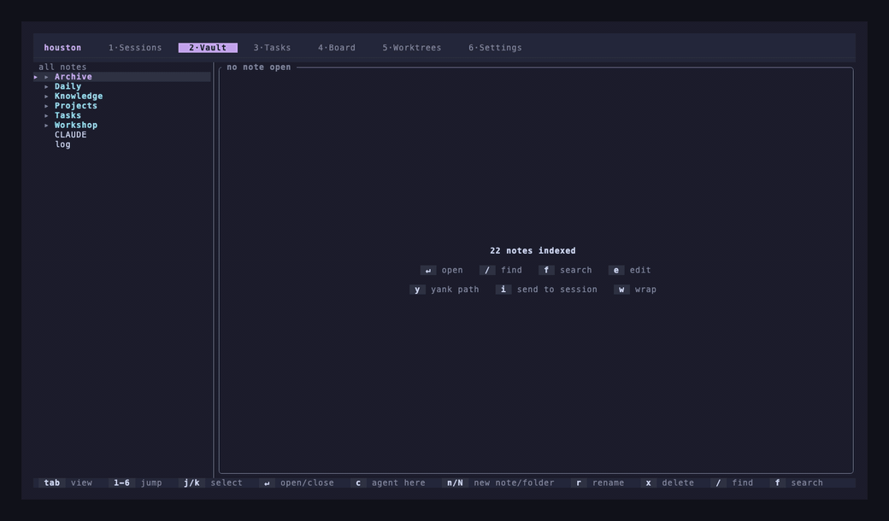

<div align="center">

# Houston

### A terminal workspace for running coding agents, and the notes they work from.

[](https://github.com/Sugar-Coffee/houston-ai/actions/workflows/ci.yml)
[](https://github.com/Sugar-Coffee/houston-ai/releases/latest)
[](LICENSE)
[](#install)

```sh
curl -fsSL https://github.com/Sugar-Coffee/houston-ai/releases/latest/download/install.sh | sh
houston
```

<sub>**Repo is private for now, so that URL 404s.** [Build from source](#install)
meanwhile. Delete this line when it goes public.</sub>

</div>

---

Three agents going at once. One rewriting an API, one grinding through a
migration, one you started an hour ago and half forgot about. Plus the shell
where the dev server lives.

Houston is one window for all of them. One keystroke to move between them.
Quit, come back tomorrow, and they are all still there, still mid-conversation.

## Every session, one key away

A sidebar of everything running, and a pane showing whichever one you are
looking at. `j` and `k` move, `↵` attaches, `ctrl-\` gets you back out.

No tab bar to hunt through, no wondering which window had the API rewrite in
it. Each card carries the name you gave it, the directory it is in, its branch,
and what it has changed so far.

<p align="center"></p>


Scrolling, selecting text and copying all work the way you would expect, with
the mouse or the keyboard.

## Close it. Come back. Still there.

This is the part that surprised me most in daily use.

Quit Houston and reopen it, and the whole set comes back: names, directories,
worktrees, and the **conversations themselves**. Claude Code resumes with
`--resume`, Codex from its rollout files. Not a fresh agent in the same folder,
the actual thread you were in.

Shells come back in the directory you left them in, not the one they started
in. It cannot bring back the dev server that was running in there, and does not
pretend it can.

## A vault that is a genuinely good editor

Houston has a markdown vault built in. Plain files in a folder, so Obsidian can
stay open on the same directory and neither of you will notice. Folder tree,
fuzzy find, full text search, `[[wikilinks]]`, backlinks.

<p align="center"></p>

The editor is modal and vim-shaped, and deliberately not a code editor. It
edits prose, and it is good at it.

The bit worth showing off is **jump mode**. Press `f` and every word on screen
grows a two letter tag. Type one and your cursor is there. The tags sit on top
of the text rather than pushing it around, so nothing moves under the word you
were aiming at while you are deciding. Stolen fair and square from
[amp](https://github.com/jmacdonald/amp).

Long lines wrap properly. It notices if Obsidian changed a file under you
instead of quietly flattening your work. Undo goes back further than you will
need.

<p align="center"></p>

## Agents that know your notes

Press `c` in the vault and you get an agent **running in the vault directory**.
It has already read your `CLAUDE.md`, your skills, your rules about where
things live. No path to type, no context to paste. It turns up knowing the
place.

`y` copies a note's path. `i` drops `@that/path` into a running agent's prompt
without pressing Return, so you can finish the sentence.

## Which one needs you

Sessions carry a state, and it comes from the agent's own **hooks** rather than
from squinting at its output. The board is that in one glance:

```
  Needs you          Working            Shells             Finished
  ┌──────────────┐   ┌──────────────┐   ┌──────────────┐   ┌──────────────┐
  │ ◆ auth-fix   │   │ ● api-rewrite│   │ $ dev-server │   │ × migrations │
  │   +142 −31   │   │   +18 −4     │   │              │   │              │
  └──────────────┘   └──────────────┘   └──────────────┘   └──────────────┘
```

Only "Needs you" gets the loud colour. If a hook stops arriving Houston admits
the status is stale rather than leaving an old one up looking current.

## Agents that do not tread on each other

Start a session in its own git worktree, so three agents can work on one repo
without fighting.

The Worktrees view says what each one is and why, because "not doing anything"
covers several situations that want different things from you:

```
  ▸ auth-fix        ● session running          ↑2
      ⑂ agent/auth      acme-api      +142 −31    close its session before removing it

    old-migration   ◆ no session, uncommitted
      ⑂ agent/migr      acme-api      +8 −0

    spike-caching   · no session, clean
      ⑂ spike           acme-api

    stranded        ⚠ repository gone
      ⑂ old-branch      —
```

Press `l` on one and Houston commits it, pushes it, opens a PR and removes the
tree. Press `v` to read the diff first, which you probably should.

## Oh, and

- **Nineteen themes.** Dracula, Tokyo Night, Catppuccin, Gruvbox, Rosé Pine,
  Kanagawa and friends. The picker repaints the whole app as you scroll it.
- **Nothing is deleted without asking**, and the question tells you what you
  are about to lose.
- **Runs Claude Code, Codex, Gemini and opencode**, or a plain shell.

## Install

```sh
curl -fsSL https://github.com/Sugar-Coffee/houston-ai/releases/latest/download/install.sh | sh
```

Works out your platform, grabs the right build, checks the checksum, drops it
in `~/.local/bin`. macOS (both chips) and Linux x86-64.

Then run it:

```sh
houston
```

That is the whole interface. If your shell cannot find it, `~/.local/bin` is
not on your `PATH` and the installer will have said so, with the line to add.

Later on, `houston update` fetches the newest release over the top of whichever
copy you are running. Houston checks once a day and mentions it in the tab
strip when there is one.

<details>
<summary>Somewhere else, or a specific version</summary>

```sh
# a different directory
curl -fsSL https://github.com/Sugar-Coffee/houston-ai/releases/latest/download/install.sh \
  | HOUSTON_INSTALL_DIR=/usr/local/bin sh

# a specific version
curl -fsSL https://github.com/Sugar-Coffee/houston-ai/releases/download/v0.0.1/install.sh \
  | HOUSTON_VERSION=v0.0.1 sh

# from source
cargo install --git https://github.com/Sugar-Coffee/houston-ai
```

The script comes from the release rather than from `main`, so the thing that
installs a version is the thing that shipped with it.
[Read it first](install.sh) if you would rather not pipe one into a shell. It
is a hundred lines of POSIX sh, short on purpose.

</details>

> **While the repo is private** neither of those can reach GitHub, so build it
> yourself:
>
> ```sh
> git clone https://github.com/Sugar-Coffee/houston-ai
> cd houston-ai && cargo build --release && ./target/release/houston
> ```

## Setting up a vault worth having

On first run Houston makes one at `~/.houston/vault/` and touches nothing else.
Already have an Obsidian vault? Point Settings at it. Nothing is copied, moved
or converted.

A vault earns its keep when agents both *read* it and *write back to it*. That
takes a bit of shape. Roughly:

```
vault/
├── CLAUDE.md              how agents should use this vault
├── log.md                 global work log, newest first
│
├── Projects/
│   └── acme-api/
│       ├── index.md       what it is, where things live, who cares
│       ├── build-log.md   what happened here, newest first
│       ├── decisions/     one file per decision, numbered
│       └── research/      measurements, dated
│
├── Knowledge/             durable reference that outlives any project
├── Daily/                 one note per day
└── Archive/               finished, kept because search does not care
```

The bit that matters is that **each project carries its own log, decisions and
research**. An agent starting work reads `index.md` and `decisions/`. An agent
finishing work appends to `build-log.md`.

Two habits make the whole thing worth having:

Write the log entry in the same commit as the work, and only when it says
something the diff cannot. A dead end, a measurement that settled an argument,
a library that behaved unexpectedly.

Record the losing argument in a decision, not just the winning one. Somebody
will re-derive it otherwise, and they deserve to know it was already
considered.

Then tell your projects the vault exists. Something like this in a project's
`CLAUDE.md`:

```markdown
## Knowledge base

Notes for this project live in `~/houston-vault/Projects/acme-api/`.

Before starting: read `index.md`, and `decisions/` before proposing anything
architectural. Most big questions have been argued already.

When finishing: append to `build-log.md` in the same commit as the work. Only
write an entry if it says something the diff cannot.
```

That is the whole trick. The vault stops being somewhere you file things and
becomes somewhere your agents work.

## Keys

`tab` between views, `1`–`5` to jump. The bar at the bottom always shows what
the current context accepts, so there is nothing to memorise.

<details>
<summary>But here are the good ones</summary>

| | |
|---|---|
| `n` · `s` | new agent · new shell |
| `↵` · `ctrl-\` | attach · detach |
| `v` · `c` | review the diff · copy text out |
| `2` then `c` | agent in the vault |
| `2` then `/` | find a note (picking one shows you where it lives) |
| `f` in the editor | jump mode |
| `l` in Worktrees | land it |
| `q q` | quit, twice, so one keystroke cannot take down a workspace |

Everything else: [`docs/keybindings.md`](docs/keybindings.md).

</details>

## Status

Pre-release, and used every day by the person who wrote it. Rust,
[ratatui](https://ratatui.rs), and
[alacritty_terminal](https://github.com/alacritty/alacritty) doing the terminal
emulation. `unsafe_code = "forbid"`, clippy pedantic clean, ~430 tests, CI on
macOS and Linux.

[Chloe](https://github.com/KevinEdry/chloe) worked out that agent status should
come from hooks, and Houston does it the same way.

MIT. See [LICENSE](LICENSE).
